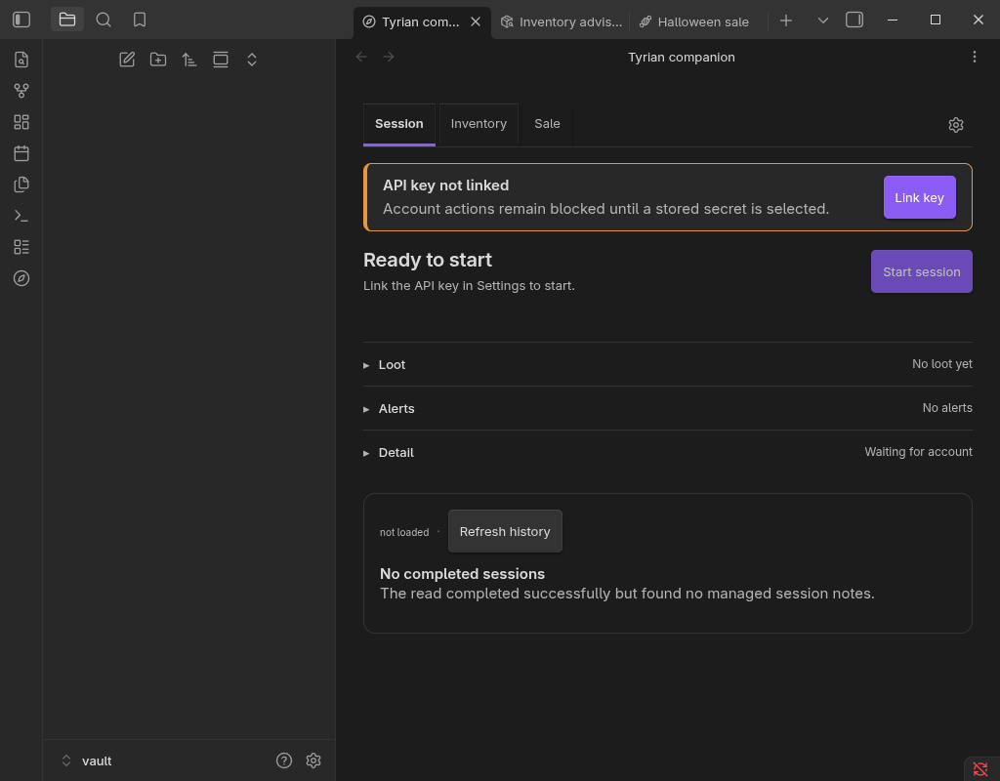

# H18.29 — gate, herramientas y cliente real, 2 oct 2026

Continúa las [correcciones de historial y arranque](2026-10-02-h18-29-correcciones.md).
David pidió resolver H8, preparar integración e instalación y revisar la matriz de QA.
La sesión principal conserva la integración y es la única operadora de Obsidian; los
escritores trabajaron en ramas y worktrees aislados.

## H8

El guard de H8 fijaba el hash completo de PLATFORM_POLICY del 26 sep (`63a67a7`).
Cuatro commits del 1 oct cambiaron exclusivamente la sección de semilla de datawars2
por acción: `2fbd717`, `9763a80`, `b6aac61` y `300080a`. Se revisó el diff completo,
se comprobó que el antiguo hash corresponde a esa base y que el texto exterior a
esa sección es idéntico. Autoridad H8, ADRs, archivos nativos y H8.8 permanecen iguales.

Se actualizó una constante, conservando el guard completo y sus controles negativos.
El validador y la suite focal pasaron tras reproducir el fallo original.

Antes de integrar se ejecutó `git fetch origin`: la base remota había avanzado a
`f011d9c` (0.2.20), con la política de cola de precios y reservas más reciente y su hash
ya actualizado. Se incorporó esa base en `44a61d7`. El único conflicto fue el hash H8: se
conservó el remoto, que coincide exactamente con la política combinada
(`cd5c5d28aae41acb78ccd58fc6a6dea0c36374b987453b349ad4d8e8bc3de4a5`).
La corrección del arranque se conserva junto a los cambios remotos del core.

## Herramientas de instalación

El CLI Obsidian 1.13.7 devuelve exit 0 también cuando `eval` imprime un error JavaScript.
La orden con `await` en el nivel superior era rechazada. `dev:install` anunciaba
`reloaded=true` sin acreditar que el plugin hubiera cargado. `smoke:live` aceptaba
versión desconocida y runtime nulo; además consultaba campos del antiguo wrapper que
ahora residen en `plugin.core`.

El perfil de QA nuevo tenía plugins comunitarios restringidos: habilitar un plugin
individual tampoco garantiza que se cargue. El perfil desechable se habilitó de forma
explícita para esta prueba. La herramienta no debe cambiar ese permiso por su cuenta.

La reparación espera el ciclo completo en una sola expresión async y exige un recibo
de la bóveda, habilitación y versiones efectivas. La revisión encontró además que un
alias de la misma ruta podía saltarse el ciclo y presentar una versión ya cargada:
se exige ahora `reloadCompleted=true`, emitido únicamente al terminar el ciclo.
La regresión reproduce el rechazo sin marcador. El smoke lee `plugin.core`, exige
runtime preparado y considera válida una conexión inactiva sin clave.

Las suites dirigidas pasan después de fallar con las implementaciones antiguas.
La prueba del código de salida del CLI se ejecutó fuera del sandbox porque este
impedía crear su subproceso; no se retiró esa regresión ni se omitió el fallo.

## QA real acotada

Se creó una bóveda vacía y un perfil de Obsidian separados, sin copiar la bóveda
canónica ni credenciales. Cliente: Obsidian 1.13.7 Flatpak en Fedora. Primera ejecución: producto local 0.2.17,
antes de incorporar la base remota. Se instalaron los
tres archivos administrados y se compararon sus SHA-256 con el build de origen.

La comprobación estricta `verify-beta-runtime` exige coincidencia de bóveda, estado
activado, versión registrada y versión cargada. Se abrió el panel de compañero: se
observan el aviso de clave no vinculada, el botón de inicio deshabilitado, el historial
vacío y `core.runtimeReady=true`. Se comprobó el DOM y se inspeccionó la captura.
También abren Inventario y Venta, con acciones de cuenta bloqueadas. Tras `obsidian restart`,
la comprobación estricta vuelve a pasar y el runtime vuelve a estar preparado en la misma
bóveda desechable. Esto acredita carga, reapertura y estado sin credenciales, no conexión
a la cuenta ni detección real del juego.

## Matriz 1–10: cobertura y pendiente

La cobertura automatizada se localizó en el candidato, y la guía QA-MVP se actualizó
para no pedir resultados antiguos ni fechas de caducidad ya sustituidas.

| Prueba | Evidencia automatizada disponible | Recorrido real pendiente |
| --- | --- | --- |
| 1 Reservas | inventory-analysis y reservation: reparto, solapamiento, tabla ausente | Ajustes, filas y Base visibles con cuenta |
| 2 Precios | sell-or-wait, position-recommendation, capture/store: precio hundido, plano, fechas, parcialidad | Cuatro casos en el panel y captura diaria |
| 3 Cierre | retry-from-error, note-writer: reintento, exclusión y concurrencia | Fallos de red/escritura y dos ventanas reales |
| 4 Suspensión | auto-recovery, resume-gap-end, main: recuperar y empezar después de guardar | Suspensión real del SO y sesión activa |
| 5 Año normal | assisted-detection, history-summary y 29 notas reales intactas | Detección en juego e historial con sesiones visibles |
| 6 Rearme | main y assisted-detection: segundo inicio sin comprobar conexión | Dos sesiones seguidas en cliente/juego |
| 7 Atribución | session-attribution y contamination: traslados, TP y moneda | Acciones reales de compra, venta, NPC y delivery |
| 8 Espacio | storage-space y advisor-classifier: mínimo observado y hueco demostrado | Ajustes y Materials.base con cuenta |
| 9 Resincronizar | inventory-vault-sync: sin cambios no escribe; precio cambia sin perder texto | Comando real con hashes y datos de cuenta |
| 10 Fechas | classifier y builtin-bundle: límites y caducidad | Avisos y guardado bajo caducidad en entorno desechable |

Ninguna fila se marca como prueba manual completa superada. No se cambia el reloj del
sistema ni se realizan acciones dentro de Guild Wars 2. La evidencia de notas reales
del primer candidato sigue identificada por `7012e5e`. Tras incorporar la base remota
se requiere verificar de nuevo el candidato combinado; no se presenta la evidencia
anterior como nueva lectura ni como QA de adquisición de sesiones.

## Verificación del candidato combinado

Candidato final de fuentes y herramientas: `e370775daef16ddcaa90abbcbe416bdb227be5b9`,
árbol `f9e0f65bb7f64221fb0fab936e3e63cacde5f9ba`, sobre `origin/main` 0.2.20
`f011d9cb6f9f51b090008ed478cad25d39a8f8de`. Entorno: Fedora, Node 22.23.1.
La documentación de resultados se añade después sin cambiar fuentes ni herramientas.

- `npm run check` en `381fc62`: exit 0, ocho pasos verdes y **4.318 tests en 268 archivos**.
- Entre `381fc62` y el candidato final solo cambian `scripts/dev-install.mjs` y su suite,
  para cerrar el hallazgo de revisión. ESLint dirigido final: exit 0; su suite vuelve a
  ejecutarse dentro del gate final de infraestructura. Se reutilizan los checks de producto
  no afectados en lugar de repetir la suite completa.
- `npm run check:guardrails` en el candidato final: exit 0, **25/25 controles verdes**.
- Revisión independiente de las herramientas y del contexto de arranque integrado: sin
  hallazgos pendientes tras cerrar el caso del alias.
- Sonda de las 29 notas en `381fc62`: exit 0, 29 válidas, hashes conservados, cero escrituras;
  pérdidas y sumas correctas. Ningún archivo `src/` cambia entre ese SHA y el candidato final.
- `npm run release:package`: exit 0. ZIP local 0.2.20 con SHA-256
  `d26d474f702b74b0a4f9fc2baa9059f5821f6e60f0a7ff6b1e4b59e20fa8138b`.
  Es un candidato local distinto de la release pública del mismo número; se identifica
  por este hash y por el commit, no solamente por el manifest.

## Instalación final observada

Sobre el candidato final y la misma bóveda desechable:

1. `npm run dev:install -- --plugin-dir <bóveda-QA>/.obsidian/plugins/tyrian-companion`:
   exit 0, recarga acreditada, versión 0.2.20. Los tres hashes instalados coinciden con
   el build del candidato.
2. `npm run smoke:live` sobre ese destino: exit 0, runtime preparado, conexión `idle`,
   puerto in-game cerrado y cero errores nuevos. No hay clave ni cuenta configurada.
3. Segunda instalación de la misma versión: exit 0. Se conserva temporalmente la referencia
   anterior en memoria y se comprueba `instanceReplaced=true`, versión 0.2.20 y runtime
   preparado. Así se observa una recarga real aunque el número de versión no cambie.
4. `obsidian restart`, seguido de `verify-beta-runtime` y `smoke:live`: exit 0 en ambos,
   versión instalada/registrada/cargada 0.2.20, runtime preparado y cero errores nuevos.
5. Panel de compañero abierto tras reiniciar: DOM y captura inspeccionados, estado sin
   clave y botón de inicio deshabilitado. Captura final incluida abajo.

Esta instalación de desarrollo no es una instalación BRAT. La bóveda canónica y sus
credenciales no se han usado para esta QA. Las diez pruebas completas que necesitan
cuenta, juego, suspensión o ventanas concurrentes permanecen abiertas en Lumbre.
H18.30 Windows/Blish y Halloween no se presentan como verificadas.

## Evidencia canónica

[Directorio de evidencia](2026-10-02-h18-29-runtime-evidence/):
[gate de producto](2026-10-02-h18-29-runtime-evidence/check-combined.log),
[gate de infraestructura](2026-10-02-h18-29-runtime-evidence/guardrails-combined.log),
[sonda de notas](2026-10-02-h18-29-runtime-evidence/history-381fc62-execution.json),
[instalación final](2026-10-02-h18-29-runtime-evidence/install-final.log),
[recarga de la misma versión](2026-10-02-h18-29-runtime-evidence/same-version-after.log),
[runtime tras reapertura](2026-10-02-h18-29-runtime-evidence/runtime-final-reopened.log),
[smoke tras reapertura](2026-10-02-h18-29-runtime-evidence/smoke-final-reopened.log) y
[hashes de los tres archivos](2026-10-02-h18-29-runtime-evidence/artifact-final-hashes.json).
Los logs rojos/verdes y el hallazgo de revisión se conservan junto a ellos; se normalizó
únicamente el espacio final de los logs y la copia textual del diff histórico.

